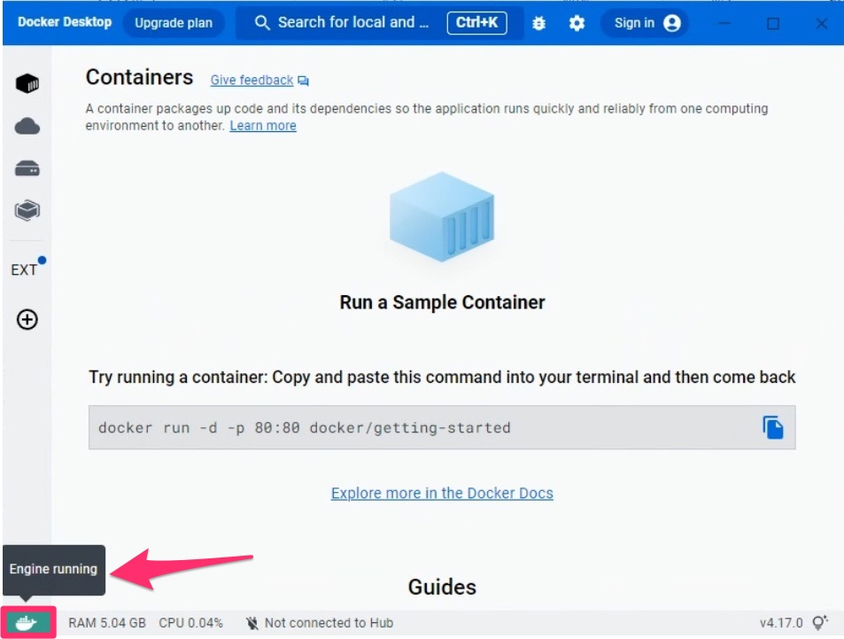
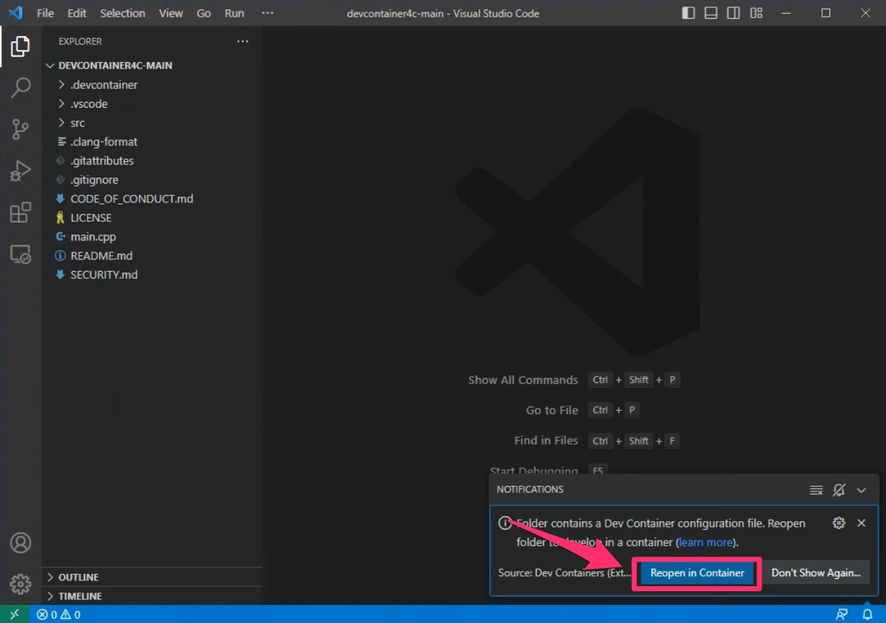
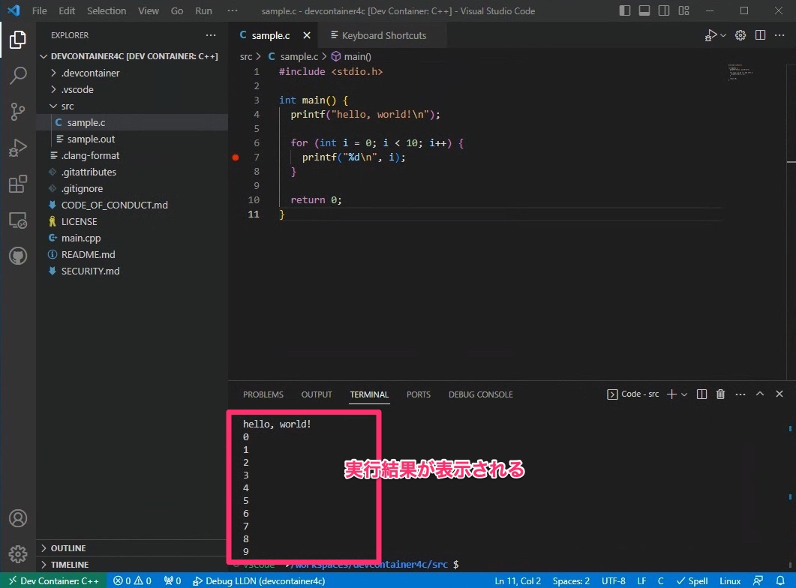
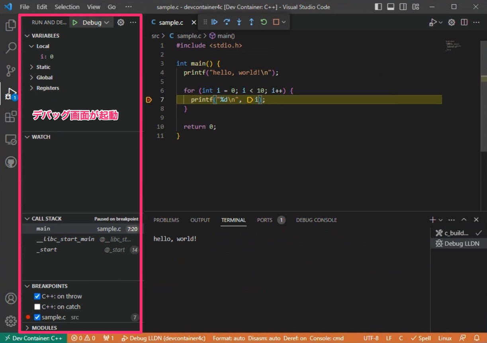

# 概要
vscodeの

# インストール
## vscodeをインストール
https://code.visualstudio.com/

## vscodeにdev containersプラグインをインストール
https://marketplace.visualstudio.com/items?itemName=ms-vscode-remote.remote-containers

## （Widows Homeの場合）
Widows Homeの場合、wslをインストールする必要あり
powershellに下記を入力

WSLをインストール

`
wsl --install
`

WSLを最新のバージョンにアップデート

`
wsl --update
`

## dockerをインストール
https://www.docker.com/

## このリポジトリをダウンロード
https://github.com/ssmyg/devcontainer4c

git cloneがおすすめですが、
zipファイルのダウンロードでもOK。

# 使い方
## dockerを起動
先にdockerを起動しておきます。
右下に「Engine running」と表示されていればOK。

## vscodeでこのリポジトリのフォルダを開く
File > Open Folder
からこのリポジトリのフォルダを開く

## Reopen in Container
右下の「Reopen in Container」を押す

# サンプルを動かしてみる
src/sample.cを開き, 下記ショートカットを押すと実行できます。

Shift + alt + n（Mac）

ctrl + alt + n（Windows）

# デバッグ
src/sample.cを開き、ブレークポイントを設定して、
F5を押すとデバッグが起動します

# 参考
下記テンプレートから作成しました。
https://github.com/microsoft/vscode-remote-try-cpp
